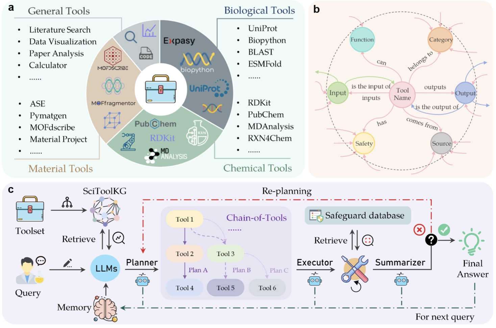

<div align="center">

<h1 align="center"> SciToolAgent: A Knowledge Graph-Driven Scientific Agent for Multi-Tool Integration </h1>

</div>


## 📌 Contents

- [⌚️ Overview](#2)
- [📦 Project Framework](#3)
- [⚡ Getting Started](#4)
  - [🔧️ Installation](#4.1)
  - [🚀 Quick Start](#4.2)
- [📊 Data Preparation](#5)
- [🛠️ Custom Tools](#6)
- [📜 SciToolEval](#7)
- [📝️ Cite](#8)

## 🆕 News

- **[2024-12]**: The SciToolAgent project is now available on GitHub.

- **[2028-08]**: Our research published in Nature Computational Science.


<h2 id="2">⌚️  Overview</h2>

SciToolAgent is a powerful agent framework designed to integrate diverse scientific tools with large language models (LLMs) to address the limitations of existing systems in scientific research. By combining LLMs as Planners, Executors, and Summarizers with a comprehensive scientific tool knowledge graph (SciToolKG), SciToolAgent autonomously plans, executes, and summarizes workflows for solving complex scientific tasks across multiple domains.

<div align=center></div>

### Key Features:
- **500+ Tools**: Access to a vast array of tools, including web APIs, machine learning models, Python functions, knowledge databases, and custom tools for tasks in various scientific domains.
- **SciToolKG**: A comprehensive knowledge graph that models relationships among hundreds of scientific tools from biology, chemistry, and materials science. It encodes tool dependencies, prerequisites, and compatibility, enabling informed tool selection and combination.
- **LLM-based Planner**: Utilizes SciToolKG to autonomously plan tool sequences for problem-solving.
- **LLM-based Executor**: Executes the planned tools in sequence, retrying where necessary to ensure accurate results.
- **LLM-based Summarizer**: Compiles and synthesizes outputs from multiple tools, generating a final solution while assessing the process for improvements.
- **Safety Checking**: A built-in safety system that monitors tool execution to prevent harmful outcomes and ensures responsible research.

<h2 id="3">📦 Project Framework</h2>

```plaintext
/SciToolAgent
├── app               # Application directory
├── data              # Data storage directory
├── KG                # SciToolKG related files
├── scripts           # Scripts for running SciToolAgent
├── test              # Testing scripts
├── SciToolEval       # SciToolEval related files
└── tools             # Tool service directory
    ├── DataFiles     # Data file storage directory (e.g., cif, csv, md, pdb, pdf, sdf, etc.)
    ├── LogFiles      # Log files storage directory
    ├── TempFiles     # Temporary files directory
    ├── TestCode      # Tool test code directory
    ├── ToolsFuns     # Core functional modules directory
    ├── utils         # Common utility functions for tools
    ├── README.md     # Project overview documentation
    ├── requirements.txt  # Python dependency list
    ├── run.sh        # One-click execution script for tool service
    ├── struct.md     # Project structure documentation of tool service
    ├── config.py     # Configuration file of tool service
    ├── example.env   # Environment variable configuration file of tool service
    └── tool_runner.py# Tool execution entry script
```

<h2 id="4">⚡ Getting Started</h2>

<h3 id="4.1">🔧️ Installation</h2>


1. **Clone the repository**  
   First, clone the project to your local machine:
   ```bash
   git clone https://github.com/HICAI-ZJU/SciToolAgent.git
   cd SciToolAgent
   ```

2. **Create and activate a virtual environment**  
Set up a new virtual environment using Conda and activate it:
    ```bash
    conda create -n SciToolAgent python=3.10
    conda activate SciToolAgent
   ```
3. **Install project dependencies**
Install the necessary dependencies for the project:
    ```bash
    pip install -r requirements.txt
    ```
    Optional: If you only need to use the agent part of SciToolAgent and do not require the pre-configured tools, you can install the dependencies from the requirement_agent.txt file instead:
    ```bash
    pip install -r requirement_agent.txt
    ```

    > Resolve package conflicts:
If you encounter any package conflicts, you can install the project without its dependencies using the following command:
    ```bash
    pip install --no-deps -e .
    ```


<h3 id="4.2">🚀Quick Start</h2>


You need to modify the `example.env` and `ToolsAgent/example.env` files to set your `API_KEY` and `API_BASE`.
* 
    ```
    OPENAI_API_BASE = your_api_base
    OPENAI_API_KEY = your_api_key
    ```

1.  Run the Tool service
    ```bash
    cd tools
    bash run.sh
    ```

    > For some AI model-driven tools, you also need to configure model files, paths, and environment information. You can find the corresponding tool code in `ToolsAgent/ToolsFuns` for specific modifications.

2.  Run the SciToolAgent
    ```bash
    cd ../test
    PYTHONPATH=. python test_run_SciToolAgent.py
    ```
We also provide four case in `Cases.ipynb`, which you can find and run in the root directory.

<h2 id="5">📊 Data Preparation</h2>


1. **Fill in the tool content**:
   - Open the `data/your_tool_KG.xlsx` file.
   - Fill in the relevant information of the tool according to the format in the file, including tool name, category, function, input, output, safety, etc.

2. **Build the Knowledge Graph (KG)**:
   - Ensure the configuration in the `scripts/generate_kg_index.py` file is correct.
   - Run the `scripts/generate_kg_index.py` script to build the knowledge graph.
   - The main function of the `scripts/generate_kg_index.py` file is to load data from the Excel file, create triplets, and build the knowledge graph. The main steps of the file are as follows:
   - Load data:
     ```python
     df = load_data(Config().DATA_FILE_PATH)
     ```
   - Create triplets:
     ```python
     triplets = create_triplets(df)
     ```
   - Build and save the knowledge graph:
     ```python
     build_knowledge_graph(triplets, Config().PERSIST_DIR)
     ```
   - Run the following command in the terminal:
     ```bash
     python scripts/generate_kg_index.py
     ```
       
By following the above steps, you can successfully build the knowledge graph.

<h2 id="6">🛠️ Custom Tools</h2>

You can add custom tools by following these steps:

1. Create a new tool in Python under `ToolsAgent/ToolsFuns`. You can follow the existing tools as examples. Format:
    ```python
    def custom_tool(parameter: str):
        # Your code here
        return result
    ```

2. Add the tool name to `tool_name_dict.py` and `tools_dict.py`.


3. Restart the tool service to apply the changes.


<h2 id="7">📜 SciToolEval</h2>
You need to save the standard answer and results of agent in the following format:

```json
{
  "question": "",
  "final_answer": ""
}
```
You can use `eval/eval_accuracy.py` to evaluate the accuracy of the results and `eval/eval_tool_path.py` to evaluate the tool path.
```bash
python eval_accuracy.py
--input_file example_input.jsonl
--standard_file example_standard_answers.jsonl
--output_file example_accuracy_evaluation_results.jsonl


python eval_tool_path.py
--input_file example_input.jsonl
--standard_file example_standard_answers.jsonl
--tool_description_file example_tools_dict.json
--output_file example_toolpath_evaluation_results.jsonl
```

`input_file` is the result of your agent's answer, `standard_file` is the standard answer file containing answer or tool_path, `tool_description_file` is the tool description file, and `output_file` is the evaluation output result file.


<h2 id="8">📝️  Cite</h2>

```
@article{ding2025scitoolagent,
  title={SciToolAgent: a knowledge-graph-driven scientific agent for multitool integration},
  author={Ding, Keyan and Yu, Jing and Huang, Junjie and Yang, Yuchen and Zhang, Qiang and Chen, Huajun},
  journal={Nature Computational Science},
  pages={1--11},
  year={2025},
  publisher={Nature Publishing Group US New York}

```
